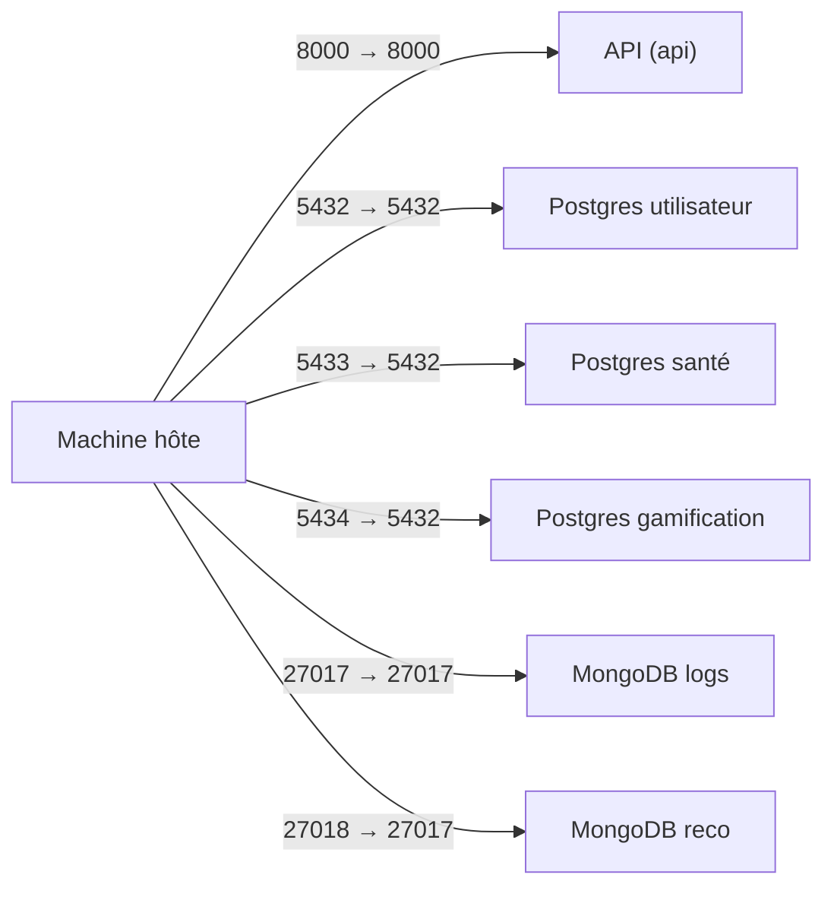
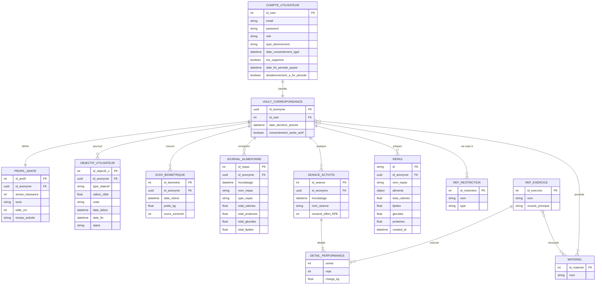
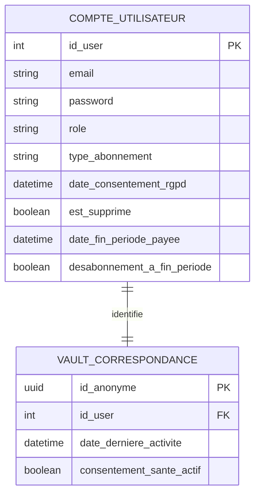
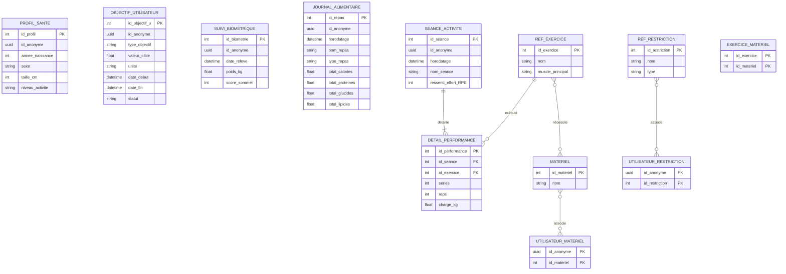
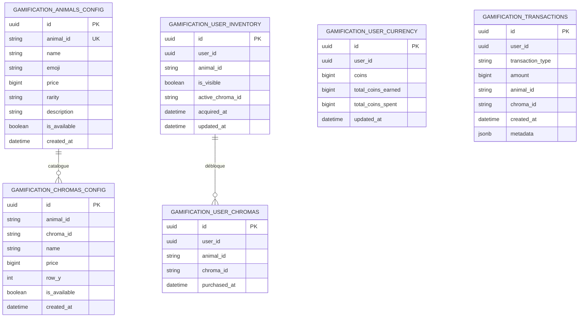
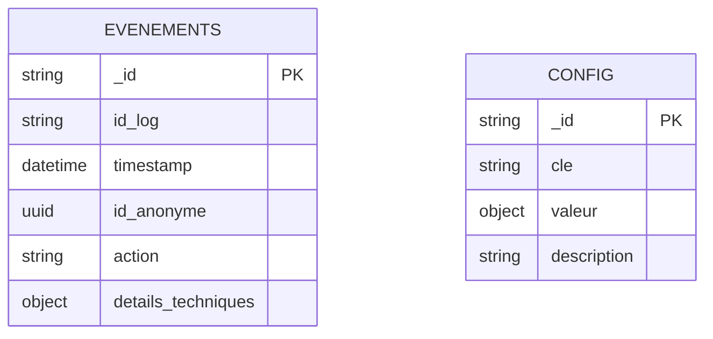
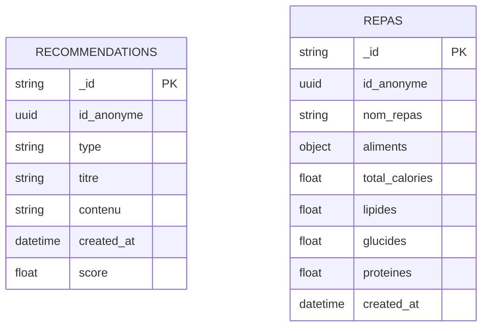

# HealthAI Coach API

API unique pour les microservices **Utilisateur**, **Santé**, **Logs** et **Recommandations** (MSPR 502). FastAPI, PostgreSQL (2 bases), MongoDB (2 bases).

---

## Lancer l'application

### Prérequis

- Docker et Docker Compose
- Fichier `.env` à la racine du projet (voir `.env.example`)

### Configuration

1. **Copier le fichier d'environnement :**
   ```bash
   cp .env.example .env
   ```
2. **Renseigner les variables** dans `.env` (mots de passe Postgres, `JWT_SECRET` pour l’auth). Ne pas versionner `.env`.

### Démarrage

À la racine du projet :

```bash
docker compose up -d --build
```

- **API** : http://localhost:8000
- **Documentation Swagger** : http://localhost:8000/docs

Les services démarrent dans cet ordre : Postgres (utilisateur + santé), MongoDB (logs + reco), puis l’API une fois les bases healthy.

### Schéma des ports exposés (hôte ↔ conteneur)

Ce récapitulatif aide à comprendre les **décalages hôte/conteneur**. À l’intérieur du réseau Docker, les services communiquent via le **nom du service** et le **port conteneur** (ex. `postgres-sante:5432`). Les ports “hôte” servent surtout pour les outils externes (psql, mongosh, navigateur, etc.).

#### Vue d’ensemble



#### Tableau (local vs hôte)

| Service               | Port conteneur | Port hôte (local) | Exemple d’accès depuis l’hôte   |
| --------------------- | -------------: | ----------------: | ------------------------------- |
| API                   |           8000 |              8000 | `http://localhost:8000`         |
| Postgres utilisateur  |           5432 |              5432 | `psql -h localhost -p 5432 ...` |
| Postgres santé        |           5432 |              5433 | `psql -h localhost -p 5433 ...` |
| Postgres gamification |           5432 |              5434 | `psql -h localhost -p 5434 ...` |
| MongoDB logs          |          27017 |             27017 | `mongosh --port 27017`          |
| MongoDB reco          |          27017 |             27018 | `mongosh --port 27018`          |

### Arrêt

```bash
docker compose down
```

### Tests automatisés (microservice `tests/`, bases pré-prod séparées)

Le dossier **`tests/`** est un petit **microservice de tests** : image Docker dédiée, **pytest** et **httpx**, uniquement des appels **HTTP** (intégration / E2E) contre l’API.

Le fichier **`docker-compose.preprod.yml`** lance une stack **parallèle** à la dev : conteneurs suffixés `-preprod`, **volumes Docker distincts** (`*_preprod_data`), **ports hôte différents** (API en **18000** par défaut). Les scripts `init/` sont les mêmes : données de test isolées de `docker compose up` classique.

| Action | Commande (à la racine du projet) |
| ------ | -------------------------------- |
| Démarrer l’API pré-prod + bases | `docker compose -f docker-compose.preprod.yml --env-file .env up -d --build` |
| Lancer la suite pytest dans un conteneur | `docker compose -f docker-compose.preprod.yml --env-file .env --profile tests run --rm tests` |
| API pré-prod sur la machine hôte | http://localhost:18000 (surcharge possible avec `PREPROD_PORT_API`) |

Si les conteneurs **Postgres pré-prod** sortent tout de suite en erreur : l’image Docker **refuse un mot de passe vide**. Le compose pré-prod applique des **valeurs par défaut** (`utilisateur_password`, `sante_password`, `gamification_password`) lorsque le `.env` ne les remplit pas, et aligne l’API sur les mêmes valeurs. Après un premier échec d’initialisation, supprimer les volumes orphelins puis relancer : `docker compose -f docker-compose.preprod.yml down -v` puis `up -d --build`.

**Sans Docker** (pré-prod ou API déjà lancée sur le port voulu) :

```bash
cd tests
pip install -r requirements.txt
# Windows PowerShell : $env:API_BASE_URL="http://127.0.0.1:18000"
export API_BASE_URL=http://127.0.0.1:18000   # Linux / macOS
python -m pytest -v tests
```

Les scénarios s’appuient sur le **seed** Postgres utilisateur (`c@c.fr` / `password`, etc., voir `init/postgres-utilisateur/02_seed.sql`).

### Initialisation des bases (schémas + données de test)

**En local** (avec `docker-compose.yml`), les dossiers `init/postgres-utilisateur` et `init/postgres-sante` sont montés dans les conteneurs Postgres : au premier démarrage, les scripts `*.sql` sont exécutés automatiquement (schéma + seed si présents).

**Sur le serveur / TrueNAS** (avec `docker-compose.truenas.yml`), les bases démarrent vides. Après `docker compose -f docker-compose.truenas.yml up -d --build`, exécuter les scripts à la main (depuis la racine du projet) :

**1) Postgres utilisateur (schéma + seed) :**

```bash
docker cp init/postgres-utilisateur/01_schema.sql postgres-utilisateur:/tmp/
docker exec postgres-utilisateur psql -U utilisateur_user -d utilisateur_db -f /tmp/01_schema.sql
docker cp init/postgres-utilisateur/02_seed.sql postgres-utilisateur:/tmp/
docker exec postgres-utilisateur psql -U utilisateur_user -d utilisateur_db -f /tmp/02_seed.sql
```

**2) Postgres santé (schéma + seed) :**

```bash
docker cp init/postgres-sante/01_schema.sql postgres-sante:/tmp/
docker exec postgres-sante psql -U sante_user -d sante_db -f /tmp/01_schema.sql
docker cp init/postgres-sante/02_seed.sql postgres-sante:/tmp/
docker exec postgres-sante psql -U sante_user -d sante_db -f /tmp/02_seed.sql
```

**3) Postgres gamification (schéma + seed) :**

```bash
docker cp init/postgres-gamification/01_schema.sql postgres-gamification:/tmp/
docker exec postgres-gamification psql -U gamification_user -d gamification_db -f /tmp/01_schema.sql
docker cp init/postgres-gamification/02_seed.sql postgres-gamification:/tmp/
docker exec postgres-gamification psql -U gamification_user -d gamification_db -f /tmp/02_seed.sql
```

**4) MongoDB logs :**

```bash
docker cp init/mongodb-logs/init.js mongodb-logs:/tmp/
docker exec mongodb-logs mongosh logs_config --file /tmp/init.js
```

**5) MongoDB reco :**

```bash
docker cp init/mongodb-reco/init.js mongodb-reco:/tmp/
docker exec mongodb-reco mongosh reco --file /tmp/init.js
```

**6) Migration abonnement (Postgres utilisateur déjà existant) :**  
À exécuter si la base `utilisateur_db` existe déjà sans les colonnes `date_fin_periode_payee` et `desabonnement_a_fin_periode` (ajout Premium / désabonnement).

```bash
docker cp init/postgres-utilisateur/04_migration_abonnement.sql postgres-utilisateur:/tmp/
docker exec postgres-utilisateur psql -U utilisateur_user -d utilisateur_db -f /tmp/04_migration_abonnement.sql
```

**7) Migration objectifs (Postgres santé déjà existant) :**  
À exécuter si la base `sante_db` existe déjà sans la colonne `date_fin` dans `objectif_utilisateur`.

```bash
docker cp init/postgres-sante/03_migration_objectif_date_fin.sql postgres-sante:/tmp/
docker exec postgres-sante psql -U sante_user -d sante_db -f /tmp/03_migration_objectif_date_fin.sql
```

**8) Migration unité objectifs (Postgres santé déjà existant) :**  
À exécuter si la base `sante_db` existe déjà sans la colonne `unite` dans `objectif_utilisateur`.

```bash
docker cp init/postgres-sante/04_migration_objectif_unite.sql postgres-sante:/tmp/
docker exec postgres-sante psql -U sante_user -d sante_db -f /tmp/04_migration_objectif_unite.sql
```

**9) Migration profil santé (Postgres santé déjà existant) :**  
À exécuter si la base `sante_db` existe déjà sans la colonne `niveau_activite` dans `profil_sante`.

```bash
docker cp init/postgres-sante/05_migration_profil_niveau_activite.sql postgres-sante:/tmp/
docker exec postgres-sante psql -U sante_user -d sante_db -f /tmp/05_migration_profil_niveau_activite.sql
```

Pour des bases déjà créées en local (volumes existants) sans init auto, les mêmes commandes Postgres/Mongo ci-dessus s’appliquent.

### Données et persistance

Les données des bases **ne sont pas** dans l’image Docker : elles sont stockées dans des **volumes nommés** déclarés dans le Compose (ex. données Postgres sous `/var/lib/postgresql/data`, MongoDB sous `/data/db`). Tant que ces volumes existent, **comptes, repas, logs, gamification**, etc. restent disponibles après un redémarrage.

| Action | Effet sur les conteneurs | Effet sur les données (volumes) |
| ------ | ------------------------ | -------------------------------- |
| `docker compose restart` ou arrêt / redémarrage de la machine | Les conteneurs redémarrent ; configuration inchangée. | **Conservées** : les bases reprennent là où elles s’étaient arrêtées. |
| `docker compose down` | Conteneurs et réseau du projet supprimés. | **Conservées** par défaut : un `docker compose up -d` recrée les conteneurs **en réattachant** les mêmes volumes. |
| `docker compose down -v` | Idem + suppression explicite des **volumes** du projet. | **Perdues** (toutes les BDD du stack). Au prochain `up`, les dossiers `init/` seront rejoués **uniquement** sur des volumes **neufs** (schéma + seed comme au premier install). |
| Rebuild `docker compose up -d --build` | Nouvelle image API si le code a changé. | **Conservées** : seul le code livré dans l’image change, pas le contenu des bases. |

**À retenir** : un « plantage » ou un redémarrage **ne vide pas** les bases tant que vous n’utilisez pas `-v` ni une suppression manuelle des volumes Docker. Pour **réinitialiser complètement** l’environnement local (repartir de zéro), il faut explicitement `down -v` ou supprimer les volumes concernés dans Docker, en acceptant la perte de données.

---

## Schéma BDD

L’architecture repose sur **deux zones** : une base **Identité** (PII, compte + vault) et une base **Santé** (données pseudonymisées via `id_anonyme`). Les logs métier et recommandations sont en MongoDB.

### Vue d’ensemble (Mermaid)



### Schémas par base (Mermaid)

#### PostgreSQL — `utilisateur_db`



#### PostgreSQL — `sante_db`



#### PostgreSQL — `gamification_db`

Base dédiée à la gamification (zoo, chromas, monnaie). Le champ **`user_id`** est un UUID aligné sur l’**`id_anonyme`** du vault (pas de FK inter-bases vers `utilisateur_db`).



#### MongoDB — `logs_config`



#### MongoDB — `reco`



### Bases et rôles

| Base / Store                     | Rôle                                                                                                                                          |
| -------------------------------- | --------------------------------------------------------------------------------------------------------------------------------------------- |
| **PostgreSQL** `utilisateur_db`  | `compte_utilisateur`, `vault_correspondance` (lien id_user ↔ id_anonyme)                                                                      |
| **PostgreSQL** `sante_db`        | Profil santé, objectifs, suivi biométrique, journal alimentaire, séances, référentiels (restrictions, exercices, matériel), tables de liaison |
| **PostgreSQL** `gamification_db` | Inventaire animaux/chromas par utilisateur, monnaie (pépites), transactions, catalogues animaux et chromas                                    |
| **MongoDB** `logs_config`        | Événements / logs (collection `evenements`) et config                                                                                         |
| **MongoDB** `reco`               | Recommandations (collection `recommendations`), repas/recettes par utilisateur (collection `repas`)                                           |

Le **vault** fait le lien RGPD entre l’identifiant nominatif (`id_user`) et l’identifiant anonyme (`id_anonyme`) utilisé partout en base Santé et dans les logs.

**Collection `repas` (MongoDB reco)** : repas/recettes par utilisateur. Chaque document contient `id_anonyme` (UUID), `nom_repas`, `aliments` (objet clé-valeur : nom aliment → dosage avec unité, ex. `"Poulet": "150 g"`), `total_calories`, `lipides`, `glucides`, `proteines`, `created_at`.

---

## API – Liste des endpoints

Base URL : `http://localhost:8000` (ou l’URL de ton déploiement).

**Authentification** : toutes les routes sauf celles marquées "Public" exigent le header :

```http
Authorization: Bearer <access_token>
```

Token obtenu via **POST /api/auth/login**.

**Logging admin** : lorsqu’un Admin ou Super-Admin consulte des données personnelles qui ne sont pas les siennes, une entrée est enregistrée en base (collection `evenements`, action `consultation_donnees_tiers`). Les routes concernées sont indiquées par la colonne **Logué** (oui/non).

---

### Racine et santé

| Méthode | Chemin    | Auth   | Logué | Description                                |
| ------- | --------- | ------ | ----- | ------------------------------------------ |
| GET     | `/`       | Public | Non   | Message d'accueil et lien vers la doc.     |
| GET     | `/health` | Public | Non   | Healthcheck (retourne `{"status": "ok"}`). |

---

### Auth

| Méthode | Chemin            | Auth   | Logué | Description                                                                                                                                                                                                                  |
| ------- | ----------------- | ------ | ----- | ---------------------------------------------------------------------------------------------------------------------------------------------------------------------------------------------------------------------------- |
| POST    | `/api/auth/login` | Public | Non   | Connexion avec email et mot de passe. Vérifie les identifiants, récupère l'`id_anonyme` (vault), renvoie un JWT. **Body** : `{"email": "...", "password": "..."}`. **Réponse** : `access_token`, `token_type`, `expires_in`. |

---

### Utilisateurs

Toutes les routes ci‑dessous exigent un token valide.

| Méthode | Chemin                                       | Rôle               | Logué                                           | Description                                                                                                                                                                                                                                                                     |
| ------- | -------------------------------------------- | ------------------ | ----------------------------------------------- | ------------------------------------------------------------------------------------------------------------------------------------------------------------------------------------------------------------------------------------------------------------------------------- |
| GET     | `/api/utilisateurs/me`                       | Tous               | Non                                             | Retourne le compte de l'utilisateur connecté (inclut `date_fin_periode_payee`, `desabonnement_a_fin_periode`).                                                                                                                                                                  |
| PATCH   | `/api/utilisateurs/me`                       | Tous               | Non                                             | Met à jour l'email et/ou le mot de passe du compte connecté. **Body** : `email`, `password` (optionnels).                                                                                                                                                                       |
| POST    | `/api/utilisateurs/me/abonnement/souscrire`  | Tous               | Non                                             | Souscrit à Premium ou Premium+ (paiement mocké : pas de vrai paiement, période 1 mois). **Body** : `{"type_abonnement": "Premium"}` ou `"Premium+"`. Réponse : compte avec `date_fin_periode_payee` et `desabonnement_a_fin_periode = false`.                                   |
| POST    | `/api/utilisateurs/me/abonnement/desabonner` | Tous               | Non                                             | Demande à ne pas renouveler : l'abonnement reste actif jusqu'à `date_fin_periode_payee`. À l'échéance, le compte repasse en Freemium (à la volée, sans cron). 400 si déjà Freemium.                                                                                             |
| GET     | `/api/utilisateurs`                          | Admin, Super-Admin | **Oui**                                         | Liste tous les comptes (id_user, email, role, type_abonnement, date_consentement_rgpd, est_supprime, date_fin_periode_payee, desabonnement_a_fin_periode). Pas de mot de passe. Consultation liste complète = logué.                                                            |
| GET     | `/api/utilisateurs/{id_user}`                | Tous               | **Oui** si admin consulte un autre `id_user`    | Détail d'un compte par `id_user`. Un **Client** ne peut accéder qu'à son propre `id_user`, sinon 403.                                                                                                                                                                           |
| DELETE  | `/api/utilisateurs/{id_user}`                | Tous               | **Oui** si admin supprime un tiers              | Suppression logique (est_supprime=true). Un **Client** ne peut supprimer que son propre compte ; **Admin/Super-Admin** peuvent supprimer n'importe quel compte. Suppression par un admin d'un tiers = logué (action `suppression_utilisateur_tiers`). Réponse : 204 No Content. |
| GET     | `/api/utilisateurs/{id_user}/vault`          | Tous               | **Oui** si admin consulte un autre `id_user`    | Récupère la ligne vault (id_anonyme, date_derniere_activite, consentement_sante_actif) pour l'utilisateur donné. Même règle d'accès : Client = uniquement son compte.                                                                                                           |
| GET     | `/api/utilisateurs/vault/{id_anonyme}`       | Tous               | **Oui** si admin consulte un autre `id_anonyme` | Récupère la ligne vault par UUID `id_anonyme`. Client = uniquement son propre `id_anonyme`.                                                                                                                                                                                     |

---

### Santé

Toutes les routes exigent un token. Pour un **Client**, les données sont limitées à son `id_anonyme` (celui du token). **Admin / Super-Admin** peuvent interroger n'importe quel `id_anonyme` via les query params quand c'est proposé.

| Méthode | Chemin                                        | Query params                   | Logué                                                | Description                                                                                                                                                               |
| ------- | --------------------------------------------- | ------------------------------ | ---------------------------------------------------- | ------------------------------------------------------------------------------------------------------------------------------------------------------------------------- |
| GET     | `/api/sante/profils`                          | `id_anonyme` (optionnel, UUID) | **Oui** si admin consulte un tiers ou liste complète | Liste les profils santé. Sans paramètre (Admin) = tous ; avec `id_anonyme` ou implicite (Client) = filtré.                                                                |
| PATCH   | `/api/sante/profils`                          | —                              | Non                                                  | Met à jour le profil santé de l'utilisateur connecté (annee_naissance, sexe, taille_cm, niveau_activite). Crée le profil s'il n'existe pas. **Body** : ProfilSanteUpdate. |
| GET     | `/api/sante/objectifs`                        | `id_anonyme` (optionnel, UUID) | **Oui** si admin consulte un tiers ou liste complète | Liste les objectifs utilisateur. Même logique de filtrage.                                                                                                                |
| POST    | `/api/sante/objectifs`                        | —                              | Non                                                  | Crée un objectif pour l'utilisateur connecté. **Body** : ObjectifCreate (type_objectif, valeur_cible, unite, date_debut, date_fin, statut).                               |
| PATCH   | `/api/sante/objectifs/{id_objectif_u}`        | —                              | Non                                                  | Met à jour un objectif de l'utilisateur connecté. **Body** : ObjectifUpdate (inclut `date_fin` et `unite`).                                                               |
| GET     | `/api/sante/suivi-biometrique`                | `id_anonyme` (optionnel, UUID) | **Oui** si admin consulte un tiers ou liste complète | Liste les relevés biométriques.                                                                                                                                           |
| POST    | `/api/sante/suivi-biometrique`                | —                              | Non                                                  | Crée un relevé biométrique pour l'utilisateur connecté. **Body** : SuiviBiometriqueCreate (date_releve, poids_kg, score_sommeil).                                         |
| PATCH   | `/api/sante/suivi-biometrique/{id_biometrie}` | —                              | Non                                                  | Met à jour un relevé biométrique de l'utilisateur connecté. **Body** : SuiviBiometriqueUpdate.                                                                            |
| GET     | `/api/sante/mes-restrictions`                 | —                              | Non                                                  | Liste les restrictions associées à l'utilisateur connecté.                                                                                                                |
| PUT     | `/api/sante/mes-restrictions`                 | —                              | Non                                                  | Remplace les restrictions de l'utilisateur connecté. **Body** : `{"id_restrictions": [1, 2, 3]}`.                                                                         |
| GET     | `/api/sante/mes-materiel`                     | —                              | Non                                                  | Liste le matériel associé à l'utilisateur connecté (id + nom).                                                                                                            |
| PUT     | `/api/sante/mes-materiel`                     | —                              | Non                                                  | Remplace le matériel de l'utilisateur connecté. **Body** : `{"id_materiels": [1, 2, 5]}`.                                                                                 |
| GET     | `/api/sante/journal`                          | `id_anonyme` (optionnel, UUID) | **Oui** si admin consulte un autre `id_anonyme`      | Liste le journal alimentaire (repas) pour un `id_anonyme`. Client = forcément le sien. Tri par date décroissante.                                                         |
| GET     | `/api/sante/seances`                          | `id_anonyme` (optionnel, UUID) | **Oui** si admin consulte un autre `id_anonyme`      | Liste les séances d'activité. Même règle. Tri par date décroissante.                                                                                                      |
| GET     | `/api/sante/referentiels/restrictions`        | —                              | Non                                                  | Liste le référentiel des restrictions (nom, type).                                                                                                                        |
| GET     | `/api/sante/referentiels/exercices`           | —                              | Non                                                  | Liste le référentiel des exercices (nom, muscle_principal).                                                                                                               |
| GET     | `/api/sante/referentiels/materiel`            | —                              | Non                                                  | Liste le référentiel du matériel.                                                                                                                                         |

---

### Journal

Création d'entrées du journal alimentaire (liste via **GET** `/api/sante/journal`).

| Méthode | Chemin                       | Auth | Logué | Description                                                                                                                                                                                                                                          |
| ------- | ---------------------------- | ---- | ----- | ---------------------------------------------------------------------------------------------------------------------------------------------------------------------------------------------------------------------------------------------------- |
| POST    | `/api/journal`               | Oui  | Non   | Crée une entrée dans le journal alimentaire de l'utilisateur connecté. **Body** : JournalCreate (horodatage, nom_repas, type_repas, total_calories, total_proteines, total_glucides, total_lipides). **Réponse** : 201 + entrée créée (JournalRead). |
| GET     | `/api/journal/calories/jour` | Oui  | Non   | Retourne le total de calories pour la journée de l'utilisateur connecté. **Query** : `date_jour=YYYY-MM-DD`. **Réponse** : `{date, total_calories}`.                                                                                                 |

---

### Logs

| Méthode | Chemin                   | Auth   | Logué                                             | Description                                                                                                                                                                                                                                              |
| ------- | ------------------------ | ------ | ------------------------------------------------- | -------------------------------------------------------------------------------------------------------------------------------------------------------------------------------------------------------------------------------------------------------- |
| GET     | `/api/logs/evenements`   | Oui    | **Oui** si admin filtre par un `id_anonyme` tiers | Liste les événements (logs). **Client** : uniquement ses événements (`id_anonyme` du token). **Admin/Super-Admin** : tous, avec filtre optionnel. **Query** : `id_anonyme` (optionnel), `action` (optionnel). Limite 100, tri par timestamp décroissant. |
| POST    | `/api/logs/evenements`   | Oui    | Non                                               | Crée un événement. **Body** : `id_anonyme`, `action`, `details_techniques` (optionnel). Pour un **Client**, `id_anonyme` est ignoré et remplacé par celui du token. **Réponse** : 201 + `id_log`, message.                                               |
| GET     | `/api/logs/config`       | Public | Non                                               | Liste toutes les entrées de config globale (cle, valeur, description).                                                                                                                                                                                   |
| GET     | `/api/logs/config/{cle}` | Public | Non                                               | Récupère une entrée de config par sa clé. 200 ou valeur nulle si absent.                                                                                                                                                                                 |

---

### Recommandations

| Méthode | Chemin                       | Auth | Logué                                             | Description                                                                                                                                                                                                                                                                                                                                                                                                                                                               |
| ------- | ---------------------------- | ---- | ------------------------------------------------- | ------------------------------------------------------------------------------------------------------------------------------------------------------------------------------------------------------------------------------------------------------------------------------------------------------------------------------------------------------------------------------------------------------------------------------------------------------------------------- |
| GET     | `/api/reco/recommendations`  | Oui  | **Oui** si admin filtre par un `id_anonyme` tiers | Liste les recommandations. **Client** : uniquement les siennes. **Admin/Super-Admin** : tous, avec filtre optionnel. **Query** : `id_anonyme` (optionnel), `type` (optionnel, ex. "nutrition", "activite"). Limite 50, tri par `created_at` décroissant.                                                                                                                                                                                                                  |
| GET     | `/api/reco/repas`            | Oui  | **Oui** si admin filtre par un `id_anonyme` tiers | Liste les repas (recettes) de l'utilisateur. **Client** : les siens. **Admin/Super-Admin** : tous, avec **Query** `id_anonyme` (optionnel). Limite 100, tri par `created_at` décroissant.                                                                                                                                                                                                                                                                                 |
| GET     | `/api/reco/repas/{repas_id}` | Oui  | Non                                               | Récupère un repas par son id (ObjectId MongoDB). Le repas doit appartenir à l'utilisateur connecté ; Admin/Super-Admin peuvent accéder à tout. 403 si accès interdit, 404 si inexistant.                                                                                                                                                                                                                                                                                  |
| POST    | `/api/reco/repas`            | Oui  | Non                                               | Crée un repas (recette) pour l'utilisateur connecté, lié à son `id_anonyme`. **Body** : `nom_repas`, `aliments` (objet clé-valeur : nom aliment → dosage avec unité, ex. `{"Poulet": "150 g", "Riz": "200 g"}`), `total_calories`, `lipides`, `glucides`, `proteines`. **Réponse** : 201 + RepasRead ; crédite **100 pépites** en base gamification (`coins_earned`, `total_coins`, `gamification_transaction_id`). Si la gamification échoue, le repas est annulé (503). |

---

### IA (programme d’exercices — Hugging Face distant)

| Méthode | Chemin                         | Auth | Description |
| ------- | ------------------------------ | ---- | ----------- |
| POST    | `/api/ia/recommandations`      | Oui  | Appelle le script `ia-reco/Ia_recom_mistral_distant.py` (Router Hugging Face). **Body** : `niveau`, `objectif`, `date_debut`, `date_fin`, `valeur_cible`, `unite`, `materiels`, et `biometrie` **ou** `suivi_biometrique` avec `poids_kg` (voir script pour les valeurs autorisées). Nécessite **`HF_API_TOKEN`** dans l’environnement de l’API. |

---

### Gamification

Ces endpoints gèrent l’inventaire (animaux + chromas), la monnaie (pépites) et le catalogue.  
Les actions utilisateur utilisent l’identifiant du token (champ `id_anonyme`, UUID) comme `user_id` en base gamification.

| Méthode | Chemin                                        | Auth                        | Description                                                                                           |
| ------- | --------------------------------------------- | --------------------------- | ----------------------------------------------------------------------------------------------------- |
| GET     | `/api/gamification/inventory`                 | Oui                         | Inventaire complet de l’utilisateur : coins, animaux possédés, chromas possédés.                      |
| POST    | `/api/gamification/animals/buy`               | Oui                         | Achat d’un animal (vérifie la propriété et les fonds).                                                |
| POST    | `/api/gamification/chromas/buy`               | Oui                         | Achat d’un chroma pour un animal possédé (vérifie propriété + fonds).                                 |
| PUT     | `/api/gamification/chromas/set-active`        | Oui                         | Définit le chroma actif d’un animal (chroma doit être possédé).                                       |
| PUT     | `/api/gamification/animals/toggle-visibility` | Oui                         | Affiche/cache un animal du zoo.                                                                       |
| POST    | `/api/gamification/coins/add`                 | Oui (**Admin/Super-Admin**) | Ajoute des pépites à un utilisateur (récompenses sport/nutrition).                                    |
| GET     | `/api/gamification/stats`                     | Oui                         | Statistiques globales (collection, rareté, complétion, coins).                                        |
| GET     | `/api/gamification/animals/catalog`           | Public ou Oui               | Catalogue des animaux + chromas (si authentifié : indique `owned`, chromas possédés et chroma actif). |

Notes :

- **Pépites** : solde initial **0** à la création du compte ; si une ligne monnaie n’existait pas encore, l’API la crée aussi à **0** (plus de valeur par défaut à 500 côté serveur).
- **Réponses** : les payloads incluent l’**`id`** de la ligne `gamification_user_currency` là où c’est pertinent (inventaire, stats, achats, admin `coins/add`), et chaque animal possédé dans l’inventaire inclut l’**`id`** de ligne d’inventaire.
- **Prix** : pour les achats, l’API valide le prix côté serveur via les tables de config (pour éviter la triche côté client).
- **Transactions** : les achats et gains créent une entrée dans `gamification_transactions`.

---

### Récapitulatif par préfixe

- **/** : racine, health (publics).
- **/api/auth** : login (public).
- **/api/utilisateurs** : comptes et vault (token + règles par rôle).
- **/api/sante** : profils, objectifs, journal (liste), séances, référentiels (token + id_anonyme selon rôle).
- **/api/journal** : création d'entrées du journal alimentaire + total calories jour (token).
- **/api/logs** : evenements (token + id_anonyme selon rôle), config (public).
- **/api/reco** : recommendations et repas (liste + détail + création), token + id_anonyme selon rôle.
- **/api/ia** : génération de programme d’exercices via modèle distant HF (token + `HF_API_TOKEN`).
- **/api/gamification** : inventaire, achats animaux/chromas, stats, catalogue (token selon route).

Documentation interactive (Swagger) : **GET** `/docs`.

---

### Détail du logging admin

Quand une route est **Logué = Oui** et qu'un Admin/Super-Admin consulte des données qui ne sont pas les siennes, un événement est enregistré dans la collection **evenements** (MongoDB, base `logs_config`) avec :

- **action** : `consultation_donnees_tiers`
- **id_anonyme** : celui de l'admin qui consulte
- **details_techniques** : `endpoint`, `role_acteur`, `id_user_acteur`, et selon le cas `id_anonyme_cible`, `id_user_cible` ou `liste_complete`

La consultation par un admin de **ses propres** données (même `id_user` ou `id_anonyme`) n'est pas loguée.

Quand un Admin/Super-Admin **supprime** le compte d'un tiers (DELETE /api/utilisateurs/{id_user} avec id_user ≠ soi-même), un événement est enregistré avec **action** : `suppression_utilisateur_tiers` et **details_techniques** : `endpoint`, `role_acteur`, `id_user_acteur`, `id_user_cible`.

---

## Sauvegardes (backup)

Le service **`backup`** produit un export des **cinq bases** du `docker-compose.yml` :

| Source | Fichier généré (dans `backups/<horodatage>/`) |
| ------ | --------------------------------------------- |
| Postgres `utilisateur_db` | `postgres-utilisateur_utilisateur_db.pgdump` |
| Postgres `sante_db` | `postgres-sante_sante_db.pgdump` |
| Postgres `gamification_db` | `postgres-gamification_gamification_db.pgdump` |
| MongoDB `logs_config` | `mongodb-logs_logs_config.archive.gz` |
| MongoDB `reco` | `mongodb-reco_reco.archive.gz` |

Les dumps Postgres sont au **format custom** (`pg_dump -F c`) : ce sont des fichiers **binaires** (pas du SQL lisible tel quel).

### Prérequis

- Fichier **`.env`** à la racine avec les mots de passe Postgres (`POSTGRES_*_USER` / `POSTGRES_*_PASSWORD`), comme pour l’API.
- Dossier local **`backups/`** : créé automatiquement ; il est listé dans **`.gitignore`** (ne pas versionner les exports).

### Lancer une sauvegarde

Le service `backup` **ne démarre pas tout seul** avec `docker compose up` : il s’exécute **à la demande**.

```bash
docker compose build backup
docker compose run --rm backup
```

- Les fichiers sont écrits sous **`./backups/<timestamp-UTC>/`** (ex. `2026-04-22T14-00-13Z`).
- Un document est inséré dans MongoDB **`mongodb-logs`**, base **`logs_config`**, collection **`backup_runs`** (`status`, `backupTimestamp`, `artifacts`, et si configuré : `uploadStatus`, `uploadDest`).

### Automatisation (planification)

Tu peux lancer la même commande **à intervalle régulier** depuis l’hôte, par exemple :

- **Windows** : **Planificateur de tâches** — créer une tâche qui exécute périodiquement un script ou une ligne de commande dans le répertoire du projet (adapter le chemin) :

  ```text
  docker compose run --rm backup
  ```

  (Option : démarrer d’abord la pile si besoin : `docker compose up -d`, puis la backup.)

- **Linux / macOS** : **`cron`** (ou **systemd timers**) — exemple de ligne crontab pour une exécution tous les jours à 3 h du matin (utilisateur qui a accès à Docker, répertoire = racine du dépôt) :

  ```cron
  0 3 * * * cd /chemin/vers/502 && docker compose run --rm backup >> /var/log/mspr502-backup.log 2>&1
  ```

**Condition** : au moment de l’exécution, les conteneurs **Postgres et MongoDB** doivent être joignables sur le réseau Compose (en pratique : `docker compose up -d` déjà lancé sur la machine, ou une tâche qui enchaîne `up -d` puis `run --rm backup`).

### Commandes utilitaires (sans relancer tout le script de backup)

L’entrée du conteneur accepte une **commande** à la place du backup complet (ex. `pg_restore`, `pg_dump`).

Chemins **dans** le conteneur : `/backups/<timestamp>/...` (monté depuis `./backups` sur l’hôte).

Exemple pour lister le contenu d’un dump :

```bash
docker compose run --rm --no-deps backup pg_restore -l /backups/<timestamp>/postgres-gamification_gamification_db.pgdump
```

Pour extraire les **données** d’une table précise en SQL (bloc `COPY` lisible) :

```bash
docker compose run --rm --no-deps backup pg_restore -a -t public.ma_table -f /backups/<timestamp>/extrait.sql /backups/<timestamp>/postgres-gamification_gamification_db.pgdump
```

### Upload optionnel vers Google Drive (rclone)

1. **Configurer rclone une fois** (OAuth : le port **53682** doit être exposé depuis le conteneur vers ta machine) :

   ```bash
   docker run -it --rm -p 53682:53682 -v "${PWD}/rclone:/config" rclone/rclone config
   ```

   Choisir **Google Drive** (`drive`), nommer le remote (ex. **`gdrive`**), laisser **`client_id` / `client_secret` vides** sauf si tu as une app Google Cloud dédiée. Répondre **`n`** à « Edit advanced config? » pour éviter la longue liste d’options. Ouvrir dans le navigateur le lien `http://127.0.0.1:53682/...` affiché par rclone.

   Le fichier de configuration est créé localement sous **`rclone/rclone/rclone.conf`** (ne pas le commiter ; voir `.gitignore`).

2. Dans **`.env`** :

   ```env
   RCLONE_REMOTE=gdrive
   RCLONE_PATH=MSPR502/backups
   ```

   (`gdrive` doit être **exactement** le nom du remote défini dans `rclone config`.)

3. Relancer la sauvegarde : après les dumps, le script exécute `rclone copy` vers  
   **`{RCLONE_REMOTE}:{RCLONE_PATH}/<timestamp>/`** sur ton Drive.  
   Si l’upload est demandé et échoue, le conteneur se termine avec un **code de sortie non nul** (les fichiers locaux restent dans `./backups/`).

Plus de détails : commentaires dans **`rclone/rclone.conf.example`** et **`.env.example`**.

---

## Dépannage

Symptômes et erreurs fréquentes en local (Docker Compose) ou après déploiement. Les messages exacts peuvent varier selon la version de Docker / l’OS.

### Docker / Compose

| Symptôme                                                                                      | Cause probable                                                                                                           | Piste de résolution                                                                                                                                                                                                                                       |
| --------------------------------------------------------------------------------------------- | ------------------------------------------------------------------------------------------------------------------------ | --------------------------------------------------------------------------------------------------------------------------------------------------------------------------------------------------------------------------------------------------------- |
| `Bind for 0.0.0.0:8000 failed: port is already allocated` (ou 5432, 5433, 5434, 27017, 27018) | Un autre programme ou un autre conteneur utilise déjà ce **port hôte**.                                                  | Arrêter l’autre service, ou modifier le mapping dans `docker-compose.yml` (ex. `"18000:8000"` pour l’API) et adapter les URLs / la doc. Sous Windows : `netstat -ano` puis repérer le PID qui écoute sur le port voulu ; terminer ce processus si besoin. |
| `dependency failed to start: container postgres-… is unhealthy`                               | Postgres (ou Mongo) met du temps à redémarrer (recovery disque), ou le healthcheck est trop strict au premier démarrage. | Attendre et relancer `docker compose up -d` ; vérifier `docker logs <nom-conteneur>`. Les healthchecks ont été assouplis (`retries`, `start_period`) pour ce cas.                                                                                         |
| `Cannot connect to the Docker daemon`                                                         | Docker Desktop arrêté ou service Docker inactif.                                                                         | Démarrer Docker Desktop (Windows) ou le service `docker`.                                                                                                                                                                                                 |
| Avertissement `Found orphan containers`                                                       | Anciens conteneurs d’un ancien `docker-compose.yml`.                                                                     | `docker compose up -d --remove-orphans` pour les nettoyer.                                                                                                                                                                                                |
| L’API ne reflète pas le dernier code Python                                                   | Image Docker **non reconstruite** après modification des fichiers.                                                       | `docker compose up -d --build api` (ou `--build` sur tout le projet).                                                                                                                                                                                     |

### Variables d’environnement et secrets

| Symptôme                                                          | Cause probable                                                                                     | Piste de résolution                                                                                                              |
| ----------------------------------------------------------------- | -------------------------------------------------------------------------------------------------- | -------------------------------------------------------------------------------------------------------------------------------- |
| Conteneur Postgres qui redémarre en boucle ou erreur au démarrage | `POSTGRES_*_PASSWORD` vide ou absent alors que l’image Postgres l’exige.                           | Renseigner tous les mots de passe dans `.env` (copie depuis `.env.example`). Ne pas commiter `.env`.                             |
| Erreur 401 / `Token invalide ou expiré`                           | JWT expiré, secret différent entre environnements, ou header `Authorization` manquant / mal formé. | Se reconnecter via `POST /api/auth/login` ; vérifier `JWT_SECRET` cohérent dans `.env` avec celui utilisé au démarrage de l’API. |

### Bases de données et données

| Symptôme                                                                                  | Cause probable                                                                                                             | Piste de résolution                                                                                                                                                                                                                         |
| ----------------------------------------------------------------------------------------- | -------------------------------------------------------------------------------------------------------------------------- | ------------------------------------------------------------------------------------------------------------------------------------------------------------------------------------------------------------------------------------------- |
| Tables vides ou schéma absent après un premier `up`                                       | Volume Postgres/Mongo **déjà existant** : les scripts `init/` ne sont exécutés **qu’au tout premier** démarrage du volume. | Soit supprimer le volume nommé (données perdues) : `docker compose down -v` puis `up`, soit appliquer les scripts SQL/JS manuellement comme indiqué dans la section **Initialisation des bases** ci-dessus (cas serveur sans montage auto). |
| Connexion refusée à `localhost:5432` depuis la machine hôte alors que le conteneur tourne | Mauvais port (ex. santé sur **5433**, gamification sur **5434**).                                                          | Voir la section **Schéma des ports exposés** ; utiliser le bon `-p` pour `psql` / client.                                                                                                                                                   |
| Erreur lors d’une route qui touche Mongo + Postgres gamification (ex. création de repas)  | Un des deux services indisponible ou mauvaise config réseau / URL.                                                         | `docker compose ps` ; logs `api`, `mongodb-reco`, `postgres-gamification`.                                                                                                                                                                  |

### Déploiement sur serveur

Problèmes typiques quand l’application tourne sur une **machine distante** (VPS, bare-metal, VM, NAS, cloud) plutôt que sur le poste de développement. Pour les principes (chemins, secrets, build, alternatives au `docker-compose.yml` principal), voir aussi **`DEPLOIEMENT.md`**.

| Symptôme                                                                | Cause probable                                                                                                                                                           | Piste de résolution                                                                                                                                                                        |
| ----------------------------------------------------------------------- | ------------------------------------------------------------------------------------------------------------------------------------------------------------------------ | ------------------------------------------------------------------------------------------------------------------------------------------------------------------------------------------ |
| `Permission denied` ou montage `init/` introuvable                      | Chemins **relatifs** (`./init/...`) invalides si le répertoire courant n’est pas la racine du projet, ou permissions du système de fichiers (NFS, stockage réseau, ACL). | Lancer Compose depuis la **racine du dépôt** ; sinon remplacer les chemins par des chemins **absolus** sur le serveur. Vérifier droits lecture sur les scripts d’init.                     |
| Variables d’environnement ignorées                                      | Le fichier `.env` n’est pas chargé (outil graphique, répertoire de travail différent, secrets injectés ailleurs).                                                        | Définir les variables dans l’interface d’hébergement ou dans la section `environment` du Compose (sans committer les secrets en clair) ; aligner `JWT_SECRET` et mots de passe avec l’API. |
| Ports exposés différents du README (8000, 5432, etc.)                   | Fichier Compose **adapté** au serveur (autre mapping), ou **conflit** avec des services déjà présents sur l’hôte.                                                        | Lire les `ports:` du YAML réellement déployé ; adapter URL, firewall et documentation interne.                                                                                             |
| API injoignable depuis l’extérieur alors que `docker compose ps` est OK | Pare-feu (ufw, security groups cloud, règles NAS), ou écoute uniquement sur `127.0.0.1`.                                                                                 | Ouvrir le port applicatif ; placer un **reverse proxy** (nginx, Traefik, Caddy) si HTTPS / nom de domaine.                                                                                 |
| Build de l’image `api` impossible sur le serveur                        | Pas d’accès Internet pour tirer les images de base, ou politique interdisant le build.                                                                                   | Builder l’image sur une CI ou une machine autorisée, pousser vers un **registry**, puis utiliser `image:` à la place de `build:` dans le Compose.                                          |
| Schémas BDD vides malgré un `up` réussi                                 | Pas de montage des dossiers `init/` (Compose « minimal ») ou volumes déjà initialisés sans scripts.                                                                      | Exécuter les scripts SQL/JS **manuellement** comme dans la section d’initialisation ; consulter les commentaires d’un éventuel fichier Compose **alternatif** du dépôt si vous l’utilisez. |

### Git

| Symptôme                                  | Cause probable                                               | Piste de résolution                                                                        |
| ----------------------------------------- | ------------------------------------------------------------ | ------------------------------------------------------------------------------------------ |
| `! [rejected] main -> main (fetch first)` | Le dépôt distant a des commits que vous n’avez pas en local. | `git pull --rebase origin main` puis `git push` (résoudre les conflits si besoin).         |
| `You are not currently on a branch`       | Rebase ou merge en cours, HEAD détachée.                     | `git status` ; terminer avec `git rebase --continue` ou `git rebase --abort` selon le cas. |

### Vérifications rapides

- **État des conteneurs** : `docker compose ps` (tous **healthy** ou **running** pour l’API).
- **API vivante** : `GET http://localhost:8000/health` → `{"status":"ok"}`.
- **Logs** : `docker logs api` ou `docker logs postgres-sante` (dernières lignes en cas d’erreur).
