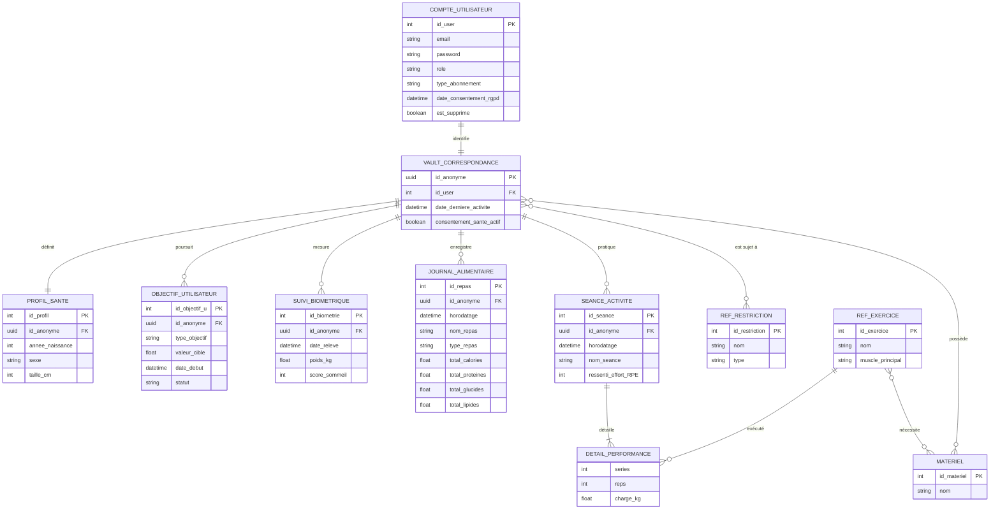

# HealthAI Coach API

API unique pour les microservices **Utilisateur**, **Santé**, **Logs** et **Recommandations** (MSPR 502). FastAPI, PostgreSQL (2 bases), MongoDB (2 bases).

---

## Lancer l'application

### Prérequis

- Docker et Docker Compose
- Fichier `.env` à la racine du projet (voir `.env.example`)

### Configuration

1. **Copier le fichier d'environnement :**
   ```bash
   cp .env.example .env
   ```
2. **Renseigner les variables** dans `.env` (mots de passe Postgres, `JWT_SECRET` pour l’auth). Ne pas versionner `.env`.

### Démarrage

À la racine du projet :

```bash
docker compose up -d --build
```

- **API** : http://localhost:8000  
- **Documentation Swagger** : http://localhost:8000/docs  

Les services démarrent dans cet ordre : Postgres (utilisateur + santé), MongoDB (logs + reco), puis l’API une fois les bases healthy.

### Arrêt

```bash
docker compose down
```

### Initialisation des bases (schémas + données de test)

En local, les dossiers `init/postgres-utilisateur` et `init/postgres-sante` sont montés dans les conteneurs Postgres : au premier démarrage, les scripts `*.sql` dans ces dossiers sont exécutés (schéma + seed si présents).

Pour des bases déjà créées (volumes existants), tu peux exécuter les scripts à la main :

```bash
# Exemple Postgres utilisateur
docker cp init/postgres-utilisateur/01_schema.sql postgres-utilisateur:/tmp/
docker exec postgres-utilisateur psql -U utilisateur_user -d utilisateur_db -f /tmp/01_schema.sql
```

---

## Schéma BDD

L’architecture repose sur **deux zones** : une base **Identité** (PII, compte + vault) et une base **Santé** (données pseudonymisées via `id_anonyme`). Les logs métier et recommandations sont en MongoDB.

### Vue d’ensemble (Mermaid)



### Bases et rôles

| Base / Store        | Rôle |
|---------------------|------|
| **PostgreSQL** `utilisateur_db` | `compte_utilisateur`, `vault_correspondance` (lien id_user ↔ id_anonyme) |
| **PostgreSQL** `sante_db`       | Profil santé, objectifs, suivi biométrique, journal alimentaire, séances, référentiels (restrictions, exercices, matériel), tables de liaison |
| **MongoDB** `logs_config`      | Événements / logs (collection `evenements`) et config |
| **MongoDB** `reco`             | Données pour les recommandations |

Le **vault** fait le lien RGPD entre l’identifiant nominatif (`id_user`) et l’identifiant anonyme (`id_anonyme`) utilisé partout en base Santé et dans les logs.

---

## API – Liste des endpoints

Base URL : `http://localhost:8000` (ou l’URL de ton déploiement).

**Authentification** : toutes les routes sauf celles marquées "Public" exigent le header :
```http
Authorization: Bearer <access_token>
```
Token obtenu via **POST /api/auth/login**.

**Logging admin** : lorsqu’un Admin ou Super-Admin consulte des données personnelles qui ne sont pas les siennes, une entrée est enregistrée en base (collection `evenements`, action `consultation_donnees_tiers`). Les routes concernées sont indiquées par la colonne **Logué** (oui/non).

---

### Racine et santé

| Méthode | Chemin | Auth | Logué | Description |
|--------|--------|------|-------|-------------|
| GET | `/` | Public | Non | Message d'accueil et lien vers la doc. |
| GET | `/health` | Public | Non | Healthcheck (retourne `{"status": "ok"}`). |

---

### Auth

| Méthode | Chemin | Auth | Logué | Description |
|--------|--------|------|-------|-------------|
| POST | `/api/auth/login` | Public | Non | Connexion avec email et mot de passe. Vérifie les identifiants, récupère l'`id_anonyme` (vault), renvoie un JWT. **Body** : `{"email": "...", "password": "..."}`. **Réponse** : `access_token`, `token_type`, `expires_in`. |

---

### Utilisateurs

Toutes les routes ci‑dessous exigent un token valide.

| Méthode | Chemin | Rôle | Logué | Description |
|--------|--------|------|-------|-------------|
| GET | `/api/utilisateurs/me` | Tous | Non | Retourne le compte de l'utilisateur connecté. |
| PATCH | `/api/utilisateurs/me` | Tous | Non | Met à jour l'email et/ou le mot de passe du compte connecté. **Body** : `email`, `password` (optionnels). |
| GET | `/api/utilisateurs` | Admin, Super-Admin | **Oui** | Liste tous les comptes (id_user, email, role, type_abonnement, date_consentement_rgpd, est_supprime). Pas de mot de passe. Consultation liste complète = logué. |
| GET | `/api/utilisateurs/{id_user}` | Tous | **Oui** si admin consulte un autre `id_user` | Détail d'un compte par `id_user`. Un **Client** ne peut accéder qu'à son propre `id_user`, sinon 403. |
| DELETE | `/api/utilisateurs/{id_user}` | Tous | **Oui** si admin supprime un tiers | Suppression logique (est_supprime=true). Un **Client** ne peut supprimer que son propre compte ; **Admin/Super-Admin** peuvent supprimer n'importe quel compte. Suppression par un admin d'un tiers = logué (action `suppression_utilisateur_tiers`). Réponse : 204 No Content. |
| GET | `/api/utilisateurs/{id_user}/vault` | Tous | **Oui** si admin consulte un autre `id_user` | Récupère la ligne vault (id_anonyme, date_derniere_activite, consentement_sante_actif) pour l'utilisateur donné. Même règle d'accès : Client = uniquement son compte. |
| GET | `/api/utilisateurs/vault/{id_anonyme}` | Tous | **Oui** si admin consulte un autre `id_anonyme` | Récupère la ligne vault par UUID `id_anonyme`. Client = uniquement son propre `id_anonyme`. |

---

### Santé

Toutes les routes exigent un token. Pour un **Client**, les données sont limitées à son `id_anonyme` (celui du token). **Admin / Super-Admin** peuvent interroger n'importe quel `id_anonyme` via les query params quand c'est proposé.

| Méthode | Chemin | Query params | Logué | Description |
|--------|--------|--------------|-------|-------------|
| GET | `/api/sante/profils` | `id_anonyme` (optionnel, UUID) | **Oui** si admin consulte un tiers ou liste complète | Liste les profils santé. Sans paramètre (Admin) = tous ; avec `id_anonyme` ou implicite (Client) = filtré. |
| PATCH | `/api/sante/profils` | — | Non | Met à jour le profil santé de l'utilisateur connecté (annee_naissance, sexe, taille_cm). Crée le profil s'il n'existe pas. **Body** : ProfilSanteUpdate. |
| GET | `/api/sante/objectifs` | `id_anonyme` (optionnel, UUID) | **Oui** si admin consulte un tiers ou liste complète | Liste les objectifs utilisateur. Même logique de filtrage. |
| PATCH | `/api/sante/objectifs/{id_objectif_u}` | — | Non | Met à jour un objectif de l'utilisateur connecté. **Body** : ObjectifUpdate. |
| GET | `/api/sante/suivi-biometrique` | `id_anonyme` (optionnel, UUID) | **Oui** si admin consulte un tiers ou liste complète | Liste les relevés biométriques. |
| PATCH | `/api/sante/suivi-biometrique/{id_biometrie}` | — | Non | Met à jour un relevé biométrique de l'utilisateur connecté. **Body** : SuiviBiometriqueUpdate. |
| GET | `/api/sante/mes-restrictions` | — | Non | Liste les restrictions associées à l'utilisateur connecté. |
| PUT | `/api/sante/mes-restrictions` | — | Non | Remplace les restrictions de l'utilisateur connecté. **Body** : `{"id_restrictions": [1, 2, 3]}`. |
| GET | `/api/sante/journal` | `id_anonyme` (optionnel, UUID) | **Oui** si admin consulte un autre `id_anonyme` | Liste le journal alimentaire (repas) pour un `id_anonyme`. Client = forcément le sien. Tri par date décroissante. |
| GET | `/api/sante/seances` | `id_anonyme` (optionnel, UUID) | **Oui** si admin consulte un autre `id_anonyme` | Liste les séances d'activité. Même règle. Tri par date décroissante. |
| GET | `/api/sante/referentiels/restrictions` | — | Non | Liste le référentiel des restrictions (nom, type). |
| GET | `/api/sante/referentiels/exercices` | — | Non | Liste le référentiel des exercices (nom, muscle_principal). |
| GET | `/api/sante/referentiels/materiel` | — | Non | Liste le référentiel du matériel. |

---

### Logs

| Méthode | Chemin | Auth | Logué | Description |
|--------|--------|------|-------|-------------|
| GET | `/api/logs/evenements` | Oui | **Oui** si admin filtre par un `id_anonyme` tiers | Liste les événements (logs). **Client** : uniquement ses événements (`id_anonyme` du token). **Admin/Super-Admin** : tous, avec filtre optionnel. **Query** : `id_anonyme` (optionnel), `action` (optionnel). Limite 100, tri par timestamp décroissant. |
| POST | `/api/logs/evenements` | Oui | Non | Crée un événement. **Body** : `id_anonyme`, `action`, `details_techniques` (optionnel). Pour un **Client**, `id_anonyme` est ignoré et remplacé par celui du token. **Réponse** : 201 + `id_log`, message. |
| GET | `/api/logs/config` | Public | Non | Liste toutes les entrées de config globale (cle, valeur, description). |
| GET | `/api/logs/config/{cle}` | Public | Non | Récupère une entrée de config par sa clé. 200 ou valeur nulle si absent. |

---

### Recommandations

| Méthode | Chemin | Auth | Logué | Description |
|--------|--------|------|-------|-------------|
| GET | `/api/reco/recommendations` | Oui | **Oui** si admin filtre par un `id_anonyme` tiers | Liste les recommandations. **Client** : uniquement les siennes. **Admin/Super-Admin** : tous, avec filtre optionnel. **Query** : `id_anonyme` (optionnel), `type` (optionnel, ex. "nutrition", "activite"). Limite 50, tri par `created_at` décroissant. |

---

### Récapitulatif par préfixe

- **/** : racine, health (publics).
- **/api/auth** : login (public).
- **/api/utilisateurs** : comptes et vault (token + règles par rôle).
- **/api/sante** : profils, objectifs, journal, séances, référentiels (token + id_anonyme selon rôle).
- **/api/logs** : evenements (token + id_anonyme selon rôle), config (public).
- **/api/reco** : recommendations (token + id_anonyme selon rôle).

Documentation interactive (Swagger) : **GET** `/docs`.

---

### Détail du logging admin

Quand une route est **Logué = Oui** et qu'un Admin/Super-Admin consulte des données qui ne sont pas les siennes, un événement est enregistré dans la collection **evenements** (MongoDB, base `logs_config`) avec :

- **action** : `consultation_donnees_tiers`
- **id_anonyme** : celui de l'admin qui consulte
- **details_techniques** : `endpoint`, `role_acteur`, `id_user_acteur`, et selon le cas `id_anonyme_cible`, `id_user_cible` ou `liste_complete`

La consultation par un admin de **ses propres** données (même `id_user` ou `id_anonyme`) n'est pas loguée.

Quand un Admin/Super-Admin **supprime** le compte d'un tiers (DELETE /api/utilisateurs/{id_user} avec id_user ≠ soi-même), un événement est enregistré avec **action** : `suppression_utilisateur_tiers` et **details_techniques** : `endpoint`, `role_acteur`, `id_user_acteur`, `id_user_cible`.
